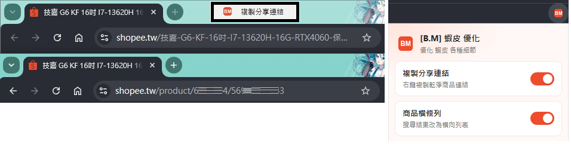
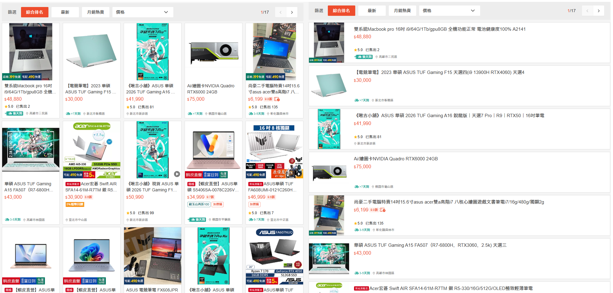

# [B.M] 蝦皮 優化

[](https://developer.chrome.com/docs/extensions/mv3/)
[](https://shopee.tw)
[](https://github.com/BoringMan314/bm-shopee-plus)
[](LICENSE)

適用於 [蝦皮購物](https://shopee.tw)（`shopee.tw` 及其他地區站）的瀏覽器擴充功能：優化商品分享連結與搜尋結果列表顯示等細節。

*优化虾皮购物页面的分享链接与商品列表等细节。*<br>
*Shopee の共有リンクや商品リスト表示などの細部を最適化します。*<br>
*Optimizes share links, product list layout, and other details on Shopee.*

> **聲明**：本專案為第三方輔助工具，與蝦皮／Shopee 官方無關。使用請遵守該站服務條款與當地法規。

---





---

## 目錄

- [功能](#功能)
- [系統需求](#系統需求)
- [安裝方式](#安裝方式)
- [本機開發與測試](#本機開發與測試)
- [技術概要](#技術概要)
- [專案結構](#專案結構)
- [版本與多語系](#版本與多語系)
- [隱私說明](#隱私說明)
- [維護者：更新 GitHub 與 Chrome 線上應用程式商店](#維護者更新-github-與-chrome-線上應用程式商店)
- [授權](#授權)
- [問題與建議](#問題與建議)

---

## 功能

### 複製分享連結

- 在蝦皮商品頁（或商品連結）**右鍵**選單新增「**複製分享連結**」。
- 將冗長 SEO／追蹤網址轉成乾淨格式，並**保留原國家站網域**（不會跨區跳站）：

```text
https://shopee.tw/…-i.6685094.56967235743?sp_atk=…
→ https://shopee.tw/product/6685094/56967235743
```

- 結構：`https://{區域主網域}/product/{賣家ID}/{商品ID}`。
- `m.shopee.tw`、`www.shopee.tw` 等會正規化為同國主網域（例如 `shopee.tw`）。

### 商品橫條列

- 搜尋結果由網格卡片改為**橫向列表**（左縮圖、右資訊）。
- 針對 `shopee-search-item-result__item` 等搜尋結果結構套用樣式。

### 功能開關

- 點工具列圖示開啟設定面板，可分別開關上述功能。
- 任一功能開啟時圖示為橘色；全部關閉時為灰色。

---

## 系統需求

- **Chrome** 或 **Microsoft Edge**（Chromium）等支援 **Manifest V3** 的瀏覽器。

---

## 安裝方式

### 從 Chrome 線上應用程式商店（建議）

若已上架，請在 [Chrome Web Store](https://chromewebstore.google.com/) 搜尋 **「[B.M] 蝦皮 優化」** 後安裝。

### 從原始碼載入（開發人員模式）

1. 點選本頁綠色 **Code** → **Download ZIP** 解壓，或執行 `git clone https://github.com/BoringMan314/bm-shopee-plus.git` 複製本倉庫。
2. 以 **Chrome** 或 **Microsoft Edge** 開啟 `chrome://extensions`（在 Edge 為 `edge://extensions`）。
3. 開啟「**開發人員模式**」→「**載入未封裝項目**」→ 選取含 [`manifest.json`](manifest.json) 的**專案根目錄**（勿選子資料夾或 `參考/`）。
4. 開啟蝦皮商品頁或搜尋結果頁，重新整理後即可測試右鍵選單與橫條列。

---

## 本機開發與測試

修改 [`background.js`](background.js)、[`share-link.js`](share-link.js)、[`content.js`](content.js)、[`content.css`](content.css) 或 [`popup.js`](popup.js) 後，在 `chrome://extensions` 將本擴充**重新載入**，再重新整理蝦皮分頁驗證。

建議驗證項目：

1. 商品頁右鍵 → 複製分享連結，確認網域與 ID 正確。
2. 搜尋結果頁開啟「商品橫條列」，確認列表排版。
3. 設定面板開關後，右鍵選單／列表樣式是否同步。

---

## 技術概要

- **Service Worker** [`background.js`](background.js)：右鍵選單、通知、圖示狀態、設定遷移；以 ES module 載入短網址邏輯。
- **短網址** [`share-link.js`](share-link.js)：解析 SEO／`/product/`／query 中的 shop／item ID，並正規化區域主網域。
- **內容腳本** [`content.js`](content.js) + [`content.css`](content.css)：依 `listLayoutEnabled` 在 `documentElement` 加上 class，將搜尋結果改為橫條列。
- **Popup** [`popup.html`](popup.html)：各功能獨立開關，狀態寫入 `chrome.storage.local`。

---

## 專案結構

| 路徑 | 說明 |
|------|------|
| [`manifest.json`](manifest.json) | Manifest V3 設定、權限、內容腳本比對網址 |
| [`background.js`](background.js) | Service Worker：選單、通知、圖示與設定 |
| [`share-link.js`](share-link.js) | 商品短網址轉換（保持原國家站） |
| [`content.js`](content.js) / [`content.css`](content.css) | 搜尋結果橫條列 |
| [`popup.html`](popup.html) / [`popup.js`](popup.js) / [`popup.css`](popup.css) | 工具列設定面板 |
| [`_locales/`](_locales/) | 多語系字串（`zh_TW`、`zh_CN`、`ja`、`en_US`） |
| [`icons/`](icons/) | 工具列圖示（含開啟／關閉狀態） |
| [`screenshot/`](screenshot/) | 商店與說明用截圖 |
| [`參考/`](參考/) | 本機開發用參考網頁（請勿打包上架） |

---

## 版本與多語系

- **版本**：以 [`manifest.json`](manifest.json) 的 `version` 為準。
- **預設語系**：`zh_TW`（`default_locale`）。
- **內建語系**：`zh_TW`、`zh_CN`、`ja`、`en_US`（路徑為 `_locales/<code>/messages.json`）。實際顯示依瀏覽器語系與遞減規則。

---

## 隱私說明

本擴充**不蒐集、不上傳**可識別個人之帳戶或瀏覽內容；**未內建**遠端可執行程式、分析或廣告追蹤。功能僅在本機執行（右鍵複製、頁面樣式與 `chrome.storage.local` 設定）。

**上架提醒**：若上架 Chrome Web Store，須在開發人員後台完成隱私實踐聲明，並提供隱私權政策之**公開 HTTPS 網址**（建議以 [GitHub Pages](https://pages.github.com/) 託管）。

---

## 維護者：更新 GitHub 與 Chrome 線上應用程式商店

### 更新至 GitHub

**Bash / Git Bash / PowerShell：**

```powershell
git add .
git commit -m "docs: 更新內容說明與商店連結"
git push origin main
```

### 更新至 Chrome 線上應用程式商店

請透過 [Chrome Web Store 開發人員控制台](https://chrome.google.com/webstore/devconsole) 手動上傳更新：

1. **遞增版本**：修改 `manifest.json` 中的 `version`（例如從 `0.1.0` 提升至 `0.1.1`）。
2. **封裝套件**：將專案內容壓縮為 ZIP 檔。
   - **必要檔案**：`manifest.json`、`background.js`、`share-link.js`、`content.js`、`content.css`、`popup.html`、`popup.js`、`popup.css`、`icons/`、`_locales/`
   - **建議不打包**：`.git/`、`.gitignore`、`README.md`、`參考/`、`screenshot/`、`*.psd`、`*.zip`、`*.url`
3. **上傳審核**：在控制台選擇項目 →「套件」→「上傳新套件」。
4. **提交送審**：確認版號、商店文案、截圖、隱私欄位與政策公開網址無誤後，點擊「**提交送審**」。

---

## 授權

本專案以 [MIT License](LICENSE) 授權。

---

## 問題與建議

歡迎透過 [GitHub Issues](https://github.com/BoringMan314/bm-shopee-plus/issues) 回報錯誤或提出改善建議。回報時請一併提供瀏覽器版本、**介面語言**、蝦皮網址（可遮敏感參數）及重現步驟。
